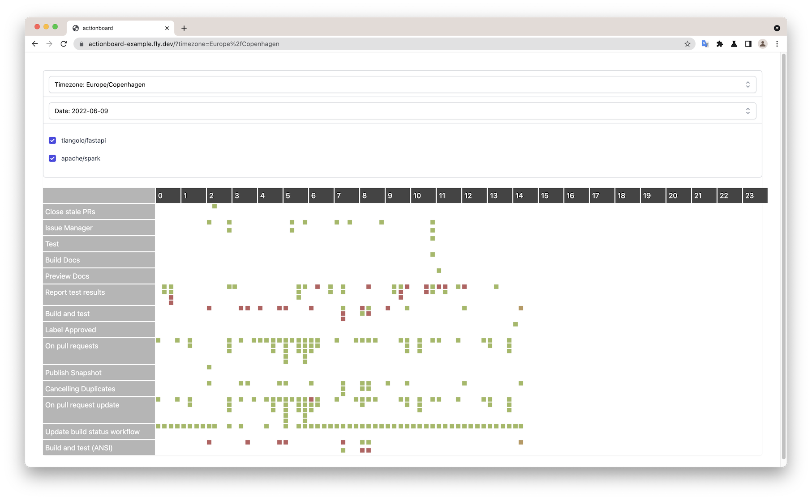

ActionBoard
=======

[](https://discord.gg/nuHmcUJN) [](https://github.com/markdessain/actionboard/tree/main) 


An overview of all your GitHub Actions in one place made simple.

Runs as a single binary with no dependencies or database required. Run ActionBoard locally on your laptop or in any cloud environment. Setup is simple and only required a GitHub Access Token to run.

Here is a screenshot of the daily overview showing workflows as they run throughout the day.




## Getting Started

Let's get ActionBoard up and running, here are some ways to get started. The binary is compiled to all operating systems and the Docker image can run on any system where Docker is installed.

### Running the Binary

The simplest way to give ActionBoard a go is to download the latest release from GitHub. You can select the binary for your operating system of choice. For example on a Intel Mac:

```bash
export GITHUB_TOKEN=...

curl -L https://github.com/markdessain/actionboard/releases/download/v0.1.1/actionboard-darwin-amd64 > actionboard
chmod +x ./actionboard
./actionboard \
--github-token=$GITHUB_TOKEN \
--repository=tiangolo/fastapi \
--repository=apache/spark \
--port=8080 \
--days=3
```

### Running with Docker

Alternatively you can also run actionboard using docker.

```bash
export GITHUB_TOKEN=...

docker pull ghcr.io/markdessain/actionboard:0.1.1
docker run -p 8080:8080 ghcr.io/markdessain/actionboard:0.1.1 \
--github-token=$GITHUB_TOKEN \
--repository=tiangolo/fastapi \
--repository=apache/spark \
--port=8080 \ 
--days=3
```


### Running on Fly.io

In [./example/fly.toml](./example/fly.toml) replace `app = "actionboard-example"`  with your applications name.

```bash
export GITHUB_TOKEN=...

cd ./example/
flyctl create --name <APPLICATION_NAME> --org personal
flyctl secrets set GITHUB_TOKEN=$GITHUB_TOKEN
flyctl deploy
flyctl scale count 1
```